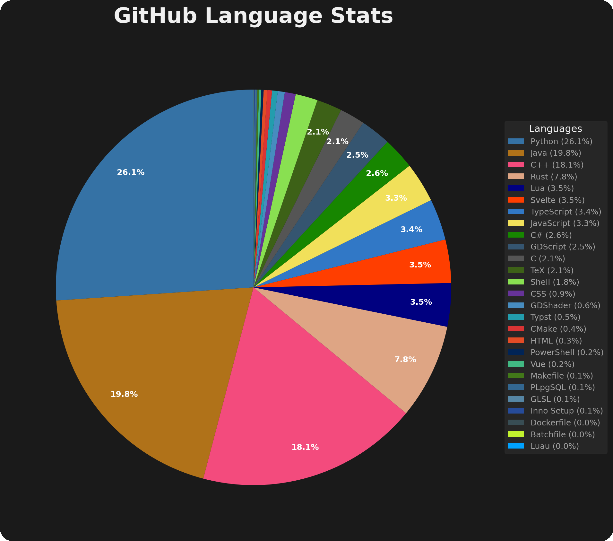
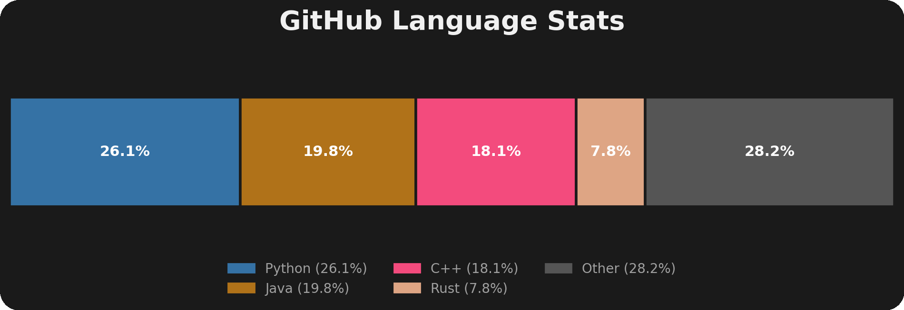

<a id="readme-top"></a>

<!-- PROJECT SHIELDS -->
<div align="center">


</div>

<!-- PROJECT LOGO -->
<div align="center">
  <h1>ghlang</h1>

  <h3 align="center">GitHub Language Statistics Visualizer</h3>

  <p align="center">
    Analyze and visualize programming language distribution across all your GitHub repositories
  </p>
</div>

<!-- TABLE OF CONTENTS -->
<details>
  <summary>Table of Contents</summary>
  <ol>
    <li>
      <a href="#about-the-project">About The Project</a>
      <ul>
        <li><a href="#built-with">Built With</a></li>
      </ul>
    </li>
    <li>
      <a href="#getting-started">Getting Started</a>
      <ul>
        <li><a href="#prerequisites">Prerequisites</a></li>
        <li><a href="#installation">Installation</a></li>
      </ul>
    </li>
    <li><a href="#usage">Usage</a></li>
    <li><a href="#configuration">Configuration</a></li>
    <li><a href="#output">Output</a></li>
    <li><a href="#license">License</a></li>
  </ol>
</details>

<!-- ABOUT THE PROJECT -->
## About The Project

**ghlang** is a command-line tool that fetches all your GitHub repositories and generates visualizations showing your programming language distribution.

### Example Output

<div align="center">
  
  
  <p><em>My personal language statistics</em></p>
</div>

<p align="right">(<a href="#readme-top">back to top</a>)</p>

### Built With

* [Python](https://www.python.org/)
* [Click](https://click.palletsprojects.com/)
* [Matplotlib](https://matplotlib.org/)
* [Requests](https://requests.readthedocs.io/)
* [Loguru](https://github.com/Delgan/loguru)

<p align="right">(<a href="#readme-top">back to top</a>)</p>

<!-- GETTING STARTED -->
## Getting Started

Get up and running with ghlang in just a few steps.

### Prerequisites

* Python 3.9 or later
* A GitHub account with repositories
* A GitHub personal access token

### Installation

1. Install with **pipx** (recommended):

   ```bash
   pipx install git+https://github.com/MihaiStreames/ghlang.git
   ```

2. Or install with **pip**:

   ```bash
   pip install git+https://github.com/MihaiStreames/ghlang.git
   ```

### Initial Setup

1. **Create a GitHub Token**
   * Navigate to [GitHub Token Settings](https://github.com/settings/tokens)
   * Click "Generate new token" (classic)
   * Select scopes:
     * `repo` (for private repository access)
     * OR `public_repo` (for public repositories only)
   * Copy the generated token

2. **First Run**

   ```bash
   ghlang
   ```

   This creates a configuration file at:
   * **Linux/macOS**: `~/.config/ghlang/config.toml`
   * **Windows**: `%LOCALAPPDATA%\ghlang\config.toml`

3. **Configure Your Token**

   Edit the config file and add your token:

   ```toml
   [github]
   token = "ghp_your_actual_token_here"
   affiliation = "owner,collaborator,organization_member"
   visibility = "all"

   [output]
   directory = "~/Documents/ghlang-stats"
   save_json = false
   save_repos = false
   top_n_languages = 5

   [preferences]
   verbose = false
   ```

4. **Generate Your Stats**

   ```bash
   ghlang
   ```

<p align="right">(<a href="#readme-top">back to top</a>)</p>

<!-- USAGE EXAMPLES -->
## Usage

### Basic Usage

Analyze all repositories using your config file:

```bash
ghlang
```

### Common Options

Override output directory:

```bash
ghlang -o ~/my-stats
```

Show top 10 languages in bar chart:

```bash
ghlang --top-n 10
```

Enable verbose logging:

```bash
ghlang -v
```

Use a custom config file:

```bash
ghlang --config ~/my-custom-config.toml
```

### Complete CLI Reference

```bash
ghlang [OPTIONS]

Options:
  -o, --output PATH      Output directory for generated files
  --top-n INTEGER        Number of languages to show in bar chart
  -v, --verbose          Enable verbose logging
  --config PATH          Path to custom config file
  --help                 Show this message and exit
```

<p align="right">(<a href="#readme-top">back to top</a>)</p>

<!-- OUTPUT -->
## Output

ghlang generates the following files in your output directory:

| File | Description |
|------|-------------|
| `language_pie.png` | Pie chart showing percentage distribution of all languages |
| `language_bar.png` | Horizontal bar chart displaying top N languages |
| `language_stats.json` | Raw language statistics data (optional) |
| `repositories.json` | Complete list of analyzed repositories (optional) |
| `github_colors.json` | GitHub's official language color mappings (optional) |

<p align="right">(<a href="#readme-top">back to top</a>)</p>

<!-- CONFIGURATION -->
## Configuration

All options are configurable via `config.toml`:

### GitHub Settings

| Option | Type | Default | Description |
|--------|------|---------|-------------|
| `token` | string | **required** | Your GitHub personal access token |
| `affiliation` | string | `"owner,collaborator,organization_member"` | Comma-separated list of repository affiliations |
| `visibility` | string | `"all"` | Repository visibility filter: `all`, `public`, or `private` |

### Output Settings

| Option | Type | Default | Description |
|--------|------|---------|-------------|
| `directory` | string | `"~/Documents/ghlang-stats"` | Output directory for generated files |
| `save_json` | boolean | `false` | Save language statistics and color data as JSON |
| `save_repos` | boolean | `false` | Save repository list as JSON |
| `top_n_languages` | integer | `5` | Number of languages to display in bar chart |

### Preferences

| Option | Type | Default | Description |
|--------|------|---------|-------------|
| `verbose` | boolean | `false` | Enable detailed logging output |

<p align="right">(<a href="#readme-top">back to top</a>)</p>

<!-- LICENSE -->
## License

Distributed under the MIT License. See [LICENSE](LICENSE) for more information.

<p align="right">(<a href="#readme-top">back to top</a>)</p>

---

<div align="center">
  <p>Made with ❤️</p>
</div>
